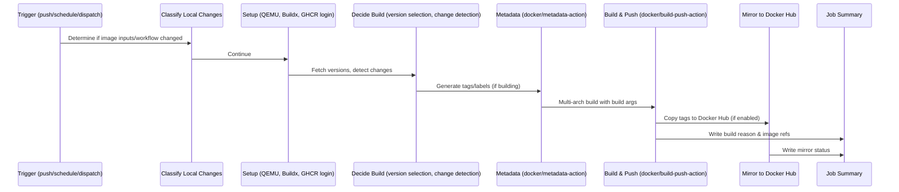

# Build System

This page documents the GitHub Actions workflow (`.github/workflows/build.yml`) that orchestrates the build, version selection, change detection, and publishing of the komodo-periphery-sops-age image.

## Workflow Overview



## Trigger Configuration

The workflow runs on three trigger types (lines 4-30):

| Trigger | Condition | Purpose |
|---------|-----------|---------|
| `push` to `main` | Paths: `Dockerfile*`, `.dockerignore`, `.github/workflows/build.yml` | Build on relevant source changes |
| `pull_request` to `main` | Same paths as push | Validation build (no push) |
| `schedule` | Daily 03:00 UTC (`00 3 * * *`) | Check upstream for changes |
| `workflow_dispatch` | Optional `force=true` input | Manual rebuild |

**Key Design:** Documentation-only changes (e.g., `README.md`) do **not** trigger builds due to path filtering.

## Local Change Classification (lines 46-87)

The `local_changes` step determines if the triggering event modified image-relevant files:

```bash
# Compares git diff between base and head SHA
# Sets outputs:
#   image_inputs_changed=true if Dockerfile* or .dockerignore changed
#   workflow_changed=true if .github/workflows/build.yml changed
```

This classification feeds into the forced-build logic for push/PR events.

## Version Selection & Change Detection (lines 129-322)

The `decide` step is the core logic. It performs:

### 1. Base Image Resolution
```bash
BASE="ghcr.io/moghtech/komodo-periphery:2"
BASE_DIGEST=$(crane digest "$BASE")
```
Resolves the current digest of the base image's major channel.

### 2. Periphery Tag Resolution
Attempts to find the `x.y.z` tag matching `BASE_DIGEST`:
1. First tries OCI labels on the base image (`org.opencontainers.image.version`, `org.label-schema.version`)
2. Falls back to scanning all tags via `crane ls`, sorting by version, and comparing digests

### 3. Tool Version Selection
```bash
SOPS_TAG=$(github-api getsops/sops/releases/latest | jq -r .tag_name)
AGE_TAG=$(github-api FiloSottile/age/releases/latest | jq -r .tag_name)
SOPS_VERSION=${SOPS_TAG#v}
AGE_VERSION=${AGE_TAG#v}
```
Fetches latest releases from upstream GitHub repos via authenticated API calls.

### 4. Current Version Reading
If the image already exists in GHCR, reads its OCI labels:
- `CURRENT_BASE_DIGEST`
- `CURRENT_BASE_VERSION`
- `CURRENT_SOPS_VERSION`
- `CURRENT_AGE_VERSION`

### 5. Change Detection Logic
```bash
CHANGED=false

# Base image changed?
if [ -z "$CURRENT_BASE_DIGEST" ] || [ "$CURRENT_BASE_DIGEST" != "$BASE_DIGEST" ]; then
  CHANGED=true
  reasons+=("komodo-periphery base changed...")
fi

# SOPS changed?
if [ "$CURRENT_SOPS_VERSION" != "$SOPS_VERSION" ]; then
  CHANGED=true
  reasons+=("SOPS updated...")
fi

# age changed?
if [ "$CURRENT_AGE_VERSION" != "$AGE_VERSION" ]; then
  CHANGED=true
  reasons+=("age updated...")
fi
```

### 6. Forced Build Conditions
| Event | Condition |
|-------|-----------|
| `workflow_dispatch` | `force=true` input |
| `pull_request` | `image_inputs_changed` OR `workflow_changed` |
| `push` | `image_inputs_changed` |

### 7. Final Decision
```bash
if [ "$FORCED" = "true" ] || [ "$CHANGED" = "true" ]; then
  do_build=true
else
  do_build=false
  reasons+=("No upstream changes detected")
fi
```

## Build & Publish (lines 325-388)

### Metadata Generation
Uses `docker/metadata-action@v6` to generate tags:
- `periphery_major_tag` (e.g., `2`)
- `periphery_minor_tag` (e.g., `2.1`)
- `periphery_tag` (e.g., `2.1.3`)

### Build Configuration
```yaml
platforms: linux/amd64,linux/arm64
push: ${{ github.event_name != 'pull_request' }}  # No push for PRs
build-args:
  BASE_DIGEST, BASE_VERSION, SOPS_VERSION, AGE_VERSION
labels:
  org.opencontainers.image.version=${{ periphery_tag }}
  org.opencontainers.image.base.name=ghcr.io/moghtech/komodo-periphery:2
  org.opencontainers.image.base.tag=${{ periphery_tag }}
  org.opencontainers.image.base.digest=${{ base_digest }}
  org.opencontainers.image.base.version=${{ periphery_tag }}
  org.opencontainers.image.sops.version=${{ sops_version }}
  org.opencontainers.image.age.version=${{ age_version }}
cache-from: type=gha
cache-to: type=gha,mode=max
```

### Docker Hub Mirroring (lines 364-388)
Conditional on:
- Build occurred (`do_build == true`)
- Not a PR
- Docker Hub credentials configured (`DOCKERHUB_USERNAME` + `DOCKERHUB_TOKEN` secrets)

Uses `crane copy` to replicate tags from GHCR to Docker Hub without rebuilding.

## Job Summary (lines 390-418)

Writes a structured markdown summary to `$GITHUB_STEP_SUMMARY` including:
- **Publish reason** - All detected change reasons
- **Selected versions** - This run's versions and URLs
- **Current versions** - Previously published versions
- **Image references** - GHCR and Docker Hub tags (or skip reasons)

## Key Outputs (from `decide` step)

| Output | Description |
|--------|-------------|
| `do_build` | `true`/`false` - Whether to proceed with build |
| `periphery_tag` | Full `x.y.z` version (e.g., `2.1.3`) |
| `periphery_major_tag` | Major only (e.g., `2`) |
| `periphery_minor_tag` | Major.minor (e.g., `2.1`) |
| `base_digest` | Base image digest |
| `sops_version` | Selected SOPS version |
| `age_version` | Selected age version |
| `reasons_md` | Markdown blob for job summary |
| `current_*` | Previously published versions for comparison |

## Change Guidance

| Change | Files to Modify |
|--------|-----------------|
| Add new trigger | `.github/workflows/build.yml` lines 4-30 (`on:` section) |
| Modify path filters | Lines 7-10, 15-17 |
| Change schedule | Line 21 (`cron`) |
| Adjust base image channel | Line 137 (`BASE` constant) |
| Add version source | Lines 192-196 (SOPS/age fetch) |
| Modify change detection | Lines 277-290 |
| Change tag scheme | Lines 331-334 (`metadata-action` tags) |
| Add OCI labels | Lines 346-355 |
| Enable/disable Docker Hub | Lines 105-126 (registries step) + secrets |
| Modify build platforms | Line 343 |

## Validation Commands

```bash
# Test workflow syntax
gh workflow run build.yml --ref main  # manual dispatch

# Local simulation of version selection logic
# (requires crane, jq, gh auth)
BASE="ghcr.io/moghtech/komodo-periphery:2"
crane digest "$BASE"
crane config "$BASE" | jq -r '.config.Labels["org.opencontainers.image.version"]'

# Check published image labels
docker pull ghcr.io/smoochy/komodo-periphery-sops-age:2
docker inspect ghcr.io/smoochy/komodo-periphery-sops-age:2 --format '{{json .Config.Labels}}' | jq
```

## Relationships

- **Orchestrates** → [Dockerfile](dockerfile.md) via build args and labels
<!-- openwiki: broken internal link [reference/image-metadata.md] file "reference/image-metadata.md" does not exist. Fix the href or restore the target, then delete this comment. -->
- **Produces** → [Image Metadata](reference/image-metadata.md) tags and labels
- **Consumes** → Base image `ghcr.io/moghtech/komodo-periphery:2`, SOPS releases, age releases
- **Publishes to** → GHCR (canonical), Docker Hub (mirror)
<!-- openwiki: broken internal link [operations/overview.md] file "operations/overview.md" does not exist. Fix the href or restore the target, then delete this comment. -->
- **Documented by** → [Operations](operations/overview.md) for runbook guidance