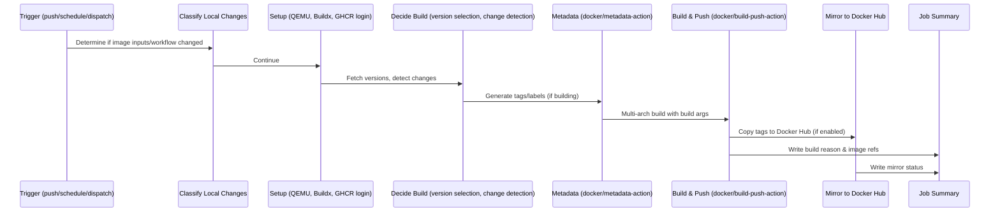

# Build System

This page documents the GitHub Actions workflow (`.github/workflows/build.yml`) that orchestrates the build, version selection, change detection, and publishing of the komodo-periphery-sops-age image.

## Workflow Overview


```mermaid
sequenceDiagram
    participant Trigger as Trigger (push/schedule/dispatch)
    participant Classify as Classify Local Changes
    participant Setup as Setup (QEMU, Buildx, GHCR login)
    participant Decide as Decide Build (version selection, change detection)
    participant Meta as Metadata (docker/metadata-action)
    participant Build as Build & Push (docker/build-push-action)
    participant Mirror as Mirror to Docker Hub
    participant Summary as Job Summary
    Trigger->>Classify: Determine if image inputs/workflow changed
    Classify->>Setup: Continue
    Setup->>Decide: Fetch versions, detect changes
    Decide->>Meta: Generate tags/labels (if building)
    Meta->>Build: Multi-arch build with build args
    Build->>Mirror: Copy tags to Docker Hub (if enabled)
    Build->>Summary: Write build reason & image refs
    Mirror->>Summary: Write mirror status
```

## Trigger Configuration

The workflow runs on three trigger types (lines 4–30 in `build.yml`):

| Trigger | Condition | Purpose |
|---------|-----------|---------|
| `push` to `main` | Paths: `Dockerfile*`, `.dockerignore`, `.github/workflows/build.yml` | Build on relevant source changes |
| `pull_request` to `main` | Same paths as push | Validation build (no push) |
| `schedule` | Daily 03:00 UTC (`00 3 * * *`) | Check upstream for changes |
| `workflow_dispatch` | Optional `force=true` input | Manual rebuild |

**Key Design:** Documentation-only changes (e.g., `README.md`) do **not** trigger builds due to path filtering. The `paths` filter ensures only changes to the Dockerfile, `.dockerignore`, or the workflow itself cause a build.

## Local Change Classification (lines 46–87)

The `local_changes` step determines if the triggering event modified image-relevant files. It compares the git diff between the base and head SHA for the event:

```bash
# Sets outputs:
#   image_inputs_changed=true if Dockerfile* or .dockerignore changed
#   workflow_changed=true if .github/workflows/build.yml changed
```

This classification feeds into the forced-build logic for push and pull_request events.

### Classification Logic

| Event | Compare From | Compare To |
|-------|--------------|------------|
| `pull_request` | `github.event.pull_request.base.sha` | `github.event.pull_request.head.sha` |
| `push` | `github.event.before` | `github.sha` |

Files are checked with `git diff --name-only`. The regex `^(Dockerfile[^/]*|\.dockerignore)$` catches `Dockerfile`, `Dockerfile.*`, and `.dockerignore`.

## Version Selection & Change Detection (lines 129–322)

The `decide` step is the core logic. It performs the following sub-steps:

### 1. Base Image Resolution

```bash
BASE="ghcr.io/moghtech/komodo-periphery:2"
BASE_DIGEST=$(crane digest "$BASE")
```

Resolves the current digest of the base image's major channel (`:2`).

### 2. Periphery Tag Resolution

Attempts to find the `x.y.z` tag matching `BASE_DIGEST`:

1. First tries OCI labels on the base image: `org.opencontainers.image.version`, `org.label-schema.version`
2. Falls back to scanning all tags via `crane ls`, sorting by version (`sort -V -r`), and comparing digests

```bash
BASE_CFG=$(crane config "$BASE")
PERIPHERY_TAG_RAW=$(echo "$BASE_CFG" | jq -r '.config.Labels["org.opencontainers.image.version"] // .config.Labels["org.label-schema.version"] // ""')
PERIPHERY_TAG="${PERIPHERY_TAG_RAW#v}"
```

If not a valid semver, falls back to tag scanning.

### 3. Tool Version Selection

Fetches latest releases from upstream GitHub repos via authenticated API calls:

```bash
SOPS_TAG=$(curl -fsSL -H "Authorization: Bearer ${GH_TOKEN}" \
  -H "Accept: application/vnd.github+json" \
  "${GH_API}/repos/getsops/sops/releases/latest" | jq -r '.tag_name')

AGE_TAG=$(curl -fsSL -H "Authorization: Bearer ${GH_TOKEN}" \
  -H "Accept: application/vnd.github+json" \
  "${GH_API}/repos/FiloSottile/age/releases/latest" | jq -r '.tag_name')

SOPS_VERSION=${SOPS_TAG#v}
AGE_VERSION=${AGE_TAG#v}
```

### 4. Current Version Reading

If the image already exists in GHCR (checked via `crane manifest`), reads its OCI labels:

| Label | Output Variable |
|-------|-----------------|
| `org.opencontainers.image.base.digest` | `CURRENT_BASE_DIGEST` |
| `org.opencontainers.image.base.version` / `org.opencontainers.image.base.tag` | `CURRENT_BASE_VERSION` |
| `org.opencontainers.image.sops.version` | `CURRENT_SOPS_VERSION` |
| `org.opencontainers.image.age.version` | `CURRENT_AGE_VERSION` |

### 5. Change Detection Logic

```bash
CHANGED=false
reasons=()

# Base image changed?
if [ -z "$CURRENT_BASE_DIGEST" ] || [ "$CURRENT_BASE_DIGEST" != "$BASE_DIGEST" ]; then
  CHANGED=true
  reasons+=("komodo-periphery base changed: ${CURRENT_BASE_DIGEST:-(none)} -> ${BASE_DIGEST}")
fi

# SOPS changed?
if [ "$CURRENT_SOPS_VERSION" != "$SOPS_VERSION" ]; then
  CHANGED=true
<!-- openwiki: broken internal link [${SOPS_RELEASE_URL}] file "${SOPS_RELEASE_URL}" does not exist. Fix the href or restore the target, then delete this comment. -->
  reasons+=("SOPS updated: ${CURRENT_SOPS_VERSION:-(none)} -> ${SOPS_VERSION} ([release notes](${SOPS_RELEASE_URL}))")
fi

# age changed?
if [ "$CURRENT_AGE_VERSION" != "$AGE_VERSION" ]; then
  CHANGED=true
<!-- openwiki: broken internal link [${AGE_RELEASE_URL}] file "${AGE_RELEASE_URL}" does not exist. Fix the href or restore the target, then delete this comment. -->
  reasons+=("age updated: ${CURRENT_AGE_VERSION:-(none)} -> ${AGE_VERSION} ([release notes](${AGE_RELEASE_URL}))")
fi
```

### 6. Forced Build Conditions

Force a build regardless of upstream changes:

| Event | Condition |
|-------|-----------|
| `workflow_dispatch` | `inputs.force == "true"` |
| `pull_request` | `image_inputs_changed == true` OR `workflow_changed == true` |
| `push` | `image_inputs_changed == true` |

**Note:** On `push`, a workflow-only change (`workflow_changed == true` but `image_inputs_changed == false`) does **not** force a build unless upstream changes are detected. This prevents unnecessary rebuilds when only CI configuration changes.

### 7. Final Decision

```bash
if [ "$FORCED" = "true" ] || [ "$CHANGED" = "true" ]; then
  echo "do_build=true" >> "$GITHUB_OUTPUT"
else
  echo "do_build=false" >> "$GITHUB_OUTPUT"
  reasons+=("No upstream changes detected (base/SOPS/age unchanged)")
fi
```

### Key Outputs from `decide` Step

| Output | Description | Used By |
|--------|-------------|---------|
| `do_build` | `true`/`false` — whether to proceed with build | `metadata`, `build-and-push`, `dockerhub-mirror`, `summary` |
| `periphery_tag` | Resolved `x.y.z` tag (e.g., `2.1.3`) | `metadata`, `build-and-push`, `dockerhub-mirror`, `summary` |
| `periphery_major_tag` | Major component (e.g., `2`) | `metadata`, `dockerhub-mirror`, `summary` |
| `periphery_minor_tag` | Major.minor (e.g., `2.1`) | `metadata`, `dockerhub-mirror`, `summary` |
| `base_digest` | Base image digest (`sha256:...`) | `build-and-push` (build arg + label) |
| `sops_version` | SOPS version (e.g., `3.8.1`) | `build-and-push` (build arg + label) |
| `age_version` | age version (e.g., `1.2.0`) | `build-and-push` (build arg + label) |
| `sops_release_url` | Full GitHub release URL | `summary` |
| `age_release_url` | Full GitHub release URL | `summary` |
| `current_base_digest` | Previously published base digest | `summary` (debugging) |
| `current_base_version` | Previously published base tag | `summary` (debugging) |
| `current_sops_version` | Previously published SOPS version | `summary` (debugging) |
| `current_age_version` | Previously published age version | `summary` (debugging) |
| `reasons_md` | Markdown block for job summary | `summary` |

## Multi-Arch Build & Push (lines 337–362)

Executed only when `do_build == 'true'`. Uses `docker/build-push-action@v7`:

| Setting | Value |
|---------|-------|
| Context | `.` |
| Dockerfile | `./Dockerfile` |
| Platforms | `linux/amd64,linux/arm64` |
| Push | `true` except on `pull_request` |
| Tags | From `metadata-action`: major, minor, patch |
| Labels | OCI labels + base digest, SOPS version, age version |
| Build Args | `BASE_DIGEST`, `BASE_VERSION`, `SOPS_VERSION`, `AGE_VERSION` |
| Cache | GitHub Actions cache (`type=gha`) |

**Build Args → Dockerfile:** These are passed to the Dockerfile as `ARG` and baked into OCI labels (see [Dockerfile Reference](dockerfile.md)).

## Docker Hub Mirroring (lines 364–388)

Conditional mirroring to Docker Hub when:
- `do_build == 'true'`
- Not a pull request
- `DOCKERHUB_USERNAME` and `DOCKERHUB_TOKEN` secrets are set

Uses `crane copy` to copy all three tags (major, minor, patch) from GHCR to Docker Hub:

```bash
for tag in "${PERIPHERY_MAJOR_TAG}" "${PERIPHERY_MINOR_TAG}" "${PERIPHERY_TAG}"; do
  crane copy "${src_base}:${tag}" "${dst_base}:${tag}"
done
```

The target repository defaults to `${DOCKERHUB_USERNAME}/${REPOSITORY_NAME}` but can be overridden via the `DOCKERHUB_REPOSITORY` variable.

## Job Summary (lines 390–418)

Always runs (`if: always()`). Writes a Markdown summary to `$GITHUB_STEP_SUMMARY` containing:

1. **Publish reason** — bullet list from `reasons_md`
2. **Selected versions (this run)** — target image, base channel, base digest, periphery tag, published tags, SOPS/age versions with release URLs
3. **Current versions (published image)** — previously published base digest/tag, SOPS, age
4. **Image** — lists pushed image refs (or "Validation build only" for PRs)
5. **Docker Hub Mirror** — status (pushed refs, skipped reasons, or failure notice)

## Local Simulation & Validation Commands

### Simulate the `decide` Step Locally

```bash
# Prerequisites: crane, jq, curl, git
# Set GH_TOKEN with packages:read scope

BASE="ghcr.io/moghtech/komodo-periphery:2"
GH_API="https://api.github.com"
AUTH_HEADER="Authorization: Bearer ${GH_TOKEN}"

# 1. Resolve base digest
BASE_DIGEST=$(crane digest "$BASE")

# 2. Resolve periphery tag
BASE_CFG=$(crane config "$BASE")
PERIPHERY_TAG_RAW=$(echo "$BASE_CFG" | jq -r '.config.Labels["org.opencontainers.image.version"] // .config.Labels["org.label-schema.version"] // ""')
PERIPHERY_TAG="${PERIPHERY_TAG_RAW#v}"

# 3. Fetch upstream versions
SOPS_TAG=$(curl -fsSL -H "$AUTH_HEADER" -H "Accept: application/vnd.github+json" \
  "${GH_API}/repos/getsops/sops/releases/latest" | jq -r '.tag_name')
AGE_TAG=$(curl -fsSL -H "$AUTH_HEADER" -H "Accept: application/vnd.github+json" \
  "${GH_API}/repos/FiloSottile/age/releases/latest" | jq -r '.tag_name')

SOPS_VERSION=${SOPS_TAG#v}
AGE_VERSION=${AGE_TAG#v}

echo "BASE_DIGEST=$BASE_DIGEST"
echo "PERIPHERY_TAG=$PERIPHERY_TAG"
echo "SOPS_VERSION=$SOPS_VERSION"
echo "AGE_VERSION=$AGE_VERSION"

# 4. Check current published image (replace with your GHCR repo)
IMAGE="ghcr.io/smoochy/komodo-periphery-sops-age"
PERIPHERY_MAJOR_TAG=$(echo "$PERIPHERY_TAG" | cut -d. -f1)
CURRENT_IMAGE="${IMAGE}:${PERIPHERY_MAJOR_TAG}"

if crane manifest "$CURRENT_IMAGE" >/dev/null 2>&1; then
  cfg=$(crane config "$CURRENT_IMAGE")
  CURRENT_BASE_DIGEST=$(echo "$cfg" | jq -r '.config.Labels["org.opencontainers.image.base.digest"] // ""')
  CURRENT_SOPS_VERSION=$(echo "$cfg" | jq -r '.config.Labels["org.opencontainers.image.sops.version"] // ""')
  CURRENT_AGE_VERSION=$(echo "$cfg" | jq -r '.config.Labels["org.opencontainers.image.age.version"] // ""')
  echo "CURRENT_BASE_DIGEST=$CURRENT_BASE_DIGEST"
  echo "CURRENT_SOPS_VERSION=$CURRENT_SOPS_VERSION"
  echo "CURRENT_AGE_VERSION=$CURRENT_AGE_VERSION"
fi
```

### Validate Dockerfile Build Args

```bash
# Build locally with the same args the workflow uses
docker buildx build \
  --platform linux/amd64,linux/arm64 \
  --build-arg BASE_DIGEST="sha256:..." \
  --build-arg BASE_VERSION="2.1.3" \
  --build-arg SOPS_VERSION="3.8.1" \
  --build-arg AGE_VERSION="1.2.0" \
  --tag test/komodo-periphery-sops-age:local \
  --load .
```

### Inspect Published Image Labels

```bash
crane config ghcr.io/smoochy/komodo-periphery-sops-age:2 | jq '.config.Labels'
```

## Related Pages

- [Dockerfile Reference](dockerfile.md) — Image construction details
- [Architecture Overview](../architecture/overview.md) — High-level component diagram
- [Image Metadata & Tags](../reference/image-metadata.md) — Tagging strategy and OCI labels
