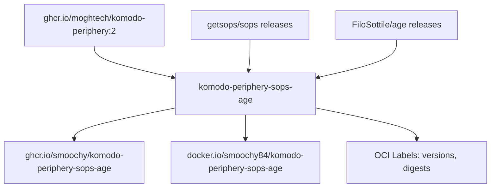

# Architecture Overview

This page describes the high-level architecture of the **komodo-periphery-sops-age** Docker image.

## Component Diagram



## Core Design

### Base Image Dependency
- **Source:** `ghcr.io/moghtech/komodo-periphery:2` (major channel 2)
- **Purpose:** Provides the Komodo Periphery runtime environment
- **Version Resolution:** The workflow resolves the exact `x.y.z` tag matching the base image's current digest
- **Correlation:** Base image digest and version are recorded in OCI labels on the built image

### Tool Installation Flow
The Dockerfile installs two independent toolchains:

1. **SOPS** (Secrets OPerationS)
   - Downloaded from `getsops/sops` GitHub releases
   - Single binary: `sops`
   - Installed to `/usr/local/bin/sops`

2. **age** (Modern encryption)
   - Downloaded from `FiloSottile/age` GitHub releases
   - Tarball contains: `age` and `age-keygen`
   - Both installed to `/usr/local/bin/`

### Multi-Architecture Support
- **Platforms:** `linux/amd64`, `linux/arm64`
- **Architecture Mapping:**
  - `amd64` → SOPS: `amd64`, age: `amd64`
  - `arm64` → SOPS: `arm64`, age: `arm64`
- **Buildx** handles cross-compilation via QEMU
- Single manifest list published per tag

### OCI Label Strategy
The image exposes version metadata via standard OCI labels:

| Label | Source | Purpose |
|-------|--------|---------|
| `org.opencontainers.image.version` | Periphery tag (x.y.z) | Image version |
| `org.opencontainers.image.base.name` | Constant | Base image reference |
| `org.opencontainers.image.base.digest` | Resolved at build time | Base image digest |
| `org.opencontainers.image.base.version` | Periphery tag | Base image version |
| `org.opencontainers.image.sops.version` | Workflow-selected | SOPS version |
| `org.opencontainers.image.age.version` | Workflow-selected | age version |
| `org.opencontainers.image.description` | Constant | Human-readable description |

## Build-Time Version Selection

**Critical:** The Dockerfile does **not** decide versions. The workflow (`.github/workflows/build.yml`) selects versions and passes them as build args:

- `SOPS_VERSION` - Latest release from `getsops/sops`
- `AGE_VERSION` - Latest release from `FiloSottile/age`
- `BASE_DIGEST` - Current digest of `ghcr.io/moghtech/komodo-periphery:2`
- `BASE_VERSION` - Resolved `x.y.z` tag for that digest

This separation allows the workflow to implement change detection and skip builds when versions haven't changed.

## Runtime Verification

The Dockerfile includes a verification step (line 42-43):
```dockerfile
sops --version --check-for-updates
age --version
```

This ensures binaries are executable and reports versions at build time.

## Relationships

- **Depends on** → [Build System](build-system.md) for version selection and publish logic
- **Implemented by** → [Dockerfile](dockerfile.md) for image construction
<!-- openwiki: broken internal link [reference/image-metadata.md] file "reference/image-metadata.md" does not exist. Fix the href or restore the target, then delete this comment. -->
- **Exposes** → [Image Metadata](reference/image-metadata.md) for tag/label details
<!-- openwiki: broken internal link [usage/overview.md] file "usage/overview.md" does not exist. Fix the href or restore the target, then delete this comment. -->
- **Consumed by** → [Usage](usage/overview.md) for pull/run examples

## Change Guidance

| Change | Where to Start |
|--------|----------------|
| Modify base image channel | `.github/workflows/build.yml` line 137 (`BASE` constant) |
| Add/remove installed tools | `Dockerfile` RUN steps (lines 23-43) |
| Change supported architectures | `.github/workflows/build.yml` line 343 (`platforms`) and Dockerfile arch mapping |
| Modify OCI labels | `.github/workflows/build.yml` lines 346-355 (labels section) |