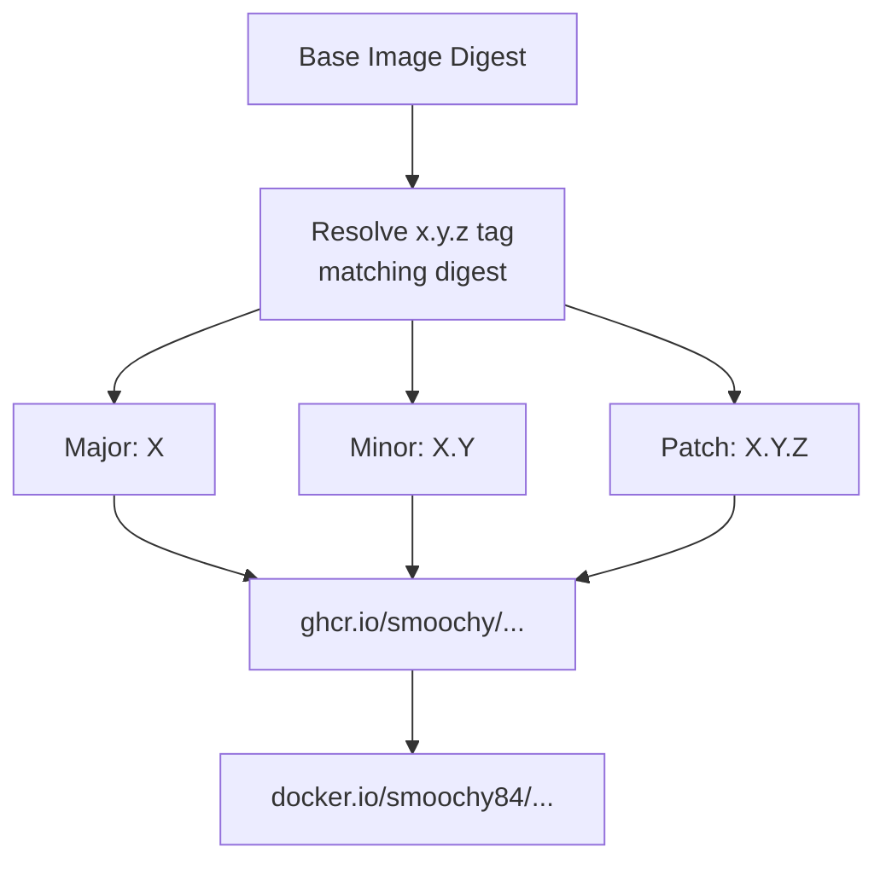

# Image Metadata & Tags

This page documents the tagging strategy, OCI labels, and version metadata for published komodo-periphery-sops-age images.

## Tagging Strategy

Each successful build publishes **three tags** derived from the resolved Komodo Periphery version (`x.y.z`):

| Tag Type | Format | Example | Mutability |
|----------|--------|---------|------------|
| **Major** | `X` | `2` | Floating (updates on major base change) |
| **Minor** | `X.Y` | `2.1` | Floating (updates on minor base change) |
| **Patch** | `X.Y.Z` | `2.1.3` | Immutable (specific build) |

### Tag Derivation Flow



### Registry Paths

| Registry | Repository | Tags |
|----------|------------|------|
| GHCR (canonical) | `ghcr.io/smoochy/komodo-periphery-sops-age` | Major, Minor, Patch |
| Docker Hub (mirror) | `smoochy84/komodo-periphery-sops-age` | Major, Minor, Patch |

## OCI Labels

Every published image carries the following OCI labels (applied via `docker/metadata-action` and Dockerfile `LABEL`):

### Image Identity
| Label | Value | Source |
|-------|-------|--------|
| `org.opencontainers.image.version` | `X.Y.Z` (patch tag) | Workflow `periphery_tag` output |
| `org.opencontainers.image.description` | `Komodo periphery with SOPS+age (auto rebuild on upstream updates)` | Workflow constant |

### Base Image Correlation
| Label | Value | Source |
|-------|-------|--------|
| `org.opencontainers.image.base.name` | `ghcr.io/moghtech/komodo-periphery:2` | Dockerfile constant |
| `org.opencontainers.image.base.tag` | `X.Y.Z` | Workflow `periphery_tag` output |
| `org.opencontainers.image.base.version` | `X.Y.Z` | Workflow `periphery_tag` output |
| `org.opencontainers.image.base.digest` | `sha256:...` | Workflow `base_digest` output |

### Tool Versions
| Label | Value | Source |
|-------|-------|--------|
| `org.opencontainers.image.sops.version` | `X.Y.Z` (e.g., `3.8.1`) | Workflow `sops_version` output |
| `org.opencontainers.image.age.version` | `X.Y.Z` (e.g., `1.2.0`) | Workflow `age_version` output |

## Version Tracking

### What Gets Tracked

| Component | Tracked Version | Update Trigger |
|-----------|-----------------|----------------|
| Komodo Periphery (base) | Digest + `x.y.z` tag | Base image digest change |
| SOPS | Release tag (e.g., `v3.8.1` → `3.8.1`) | New GitHub release on `getsops/sops` |
| age | Release tag (e.g., `v1.2.0` → `1.2.0`) | New GitHub release on `FiloSottile/age` |

### Change Detection Logic

The workflow compares **current** (published image labels) vs **selected** (this run's resolved versions):

```bash
# Base image
CURRENT_BASE_DIGEST != BASE_DIGEST  → rebuild

# SOPS
CURRENT_SOPS_VERSION != SOPS_VERSION  → rebuild

# age
CURRENT_AGE_VERSION != AGE_VERSION  → rebuild
```

### Version History Access

```bash
# List all tags for the image
crane ls ghcr.io/smoochy/komodo-periphery-sops-age

# Inspect labels for a specific tag
crane config ghcr.io/smoochy/komodo-periphery-sops-age:2.1.3 | jq '.config.Labels'

# Get digest for a tag
crane digest ghcr.io/smoochy/komodo-periphery-sops-age:2.1.3
```

## Base Image Correlation

The build system maintains a **strong correlation** between this image and its base:

1. **Base channel:** Always `ghcr.io/moghtech/komodo-periphery:2` (major 2)
2. **Resolved tag:** The workflow finds the exact `x.y.z` tag whose digest matches the current `:2` digest
3. **Labels record:** Both the digest and the resolved tag are stored in the built image
4. **Tag alignment:** This image's tags mirror the base image's resolved `x.y.z` version

### Why This Matters

- **Traceability:** Given a komodo-periphery-sops-age tag, you can identify the exact base image build
- **Reproducibility:** Rebuilding with the same base digest produces the same periphery tag
- **Upgrade visibility:** Base image changes are explicit in job summaries and labels

## Image Inspection Examples

### View All Metadata for a Tag

```bash
# Using crane (no local image needed)
crane config ghcr.io/smoochy/komodo-periphery-sops-age:2.1.3 | jq '.config.Labels'

# Using docker (requires pull)
docker pull ghcr.io/smoochy/komodo-periphery-sops-age:2.1.3
docker inspect ghcr.io/smoochy/komodo-periphery-sops-age:2.1.3 --format '{{json .Config.Labels}}' | jq
```

### Sample Label Output

```json
{
  "org.opencontainers.image.version": "2.1.3",
  "org.opencontainers.image.description": "Komodo periphery with SOPS+age (auto rebuild on upstream updates)",
  "org.opencontainers.image.base.name": "ghcr.io/moghtech/komodo-periphery:2",
  "org.opencontainers.image.base.tag": "2.1.3",
  "org.opencontainers.image.base.version": "2.1.3",
  "org.opencontainers.image.base.digest": "sha256:a1b2c3d4e5f6...",
  "org.opencontainers.image.sops.version": "3.8.1",
  "org.opencontainers.image.age.version": "1.2.0"
}
```

### Verify Tool Versions at Runtime

```bash
docker run --rm ghcr.io/smoochy/komodo-periphery-sops-age:2 sops --version
# Expected: sops 3.8.1 (or current version)

docker run --rm ghcr.io/smoochy/komodo-periphery-sops-age:2 age --version
# Expected: age v1.2.0 (or current version)
```

## Tag Immutability & Updates

| Tag | Behavior |
|-----|----------|
| **Patch (`X.Y.Z`)** | **Immutable** - Never overwritten once published. Each unique combination of base+SOPS+age gets a unique patch tag. |
| **Minor (`X.Y`)** | **Floating** - Updated when base image minor version changes (e.g., `2.1` → `2.2`). Points to latest patch in that minor. |
| **Major (`X`)** | **Floating** - Updated when base image major version changes (e.g., `2` → `3`). Points to latest minor/patch. |

## Change Guidance

| Change | Where to Modify |
|--------|-----------------|
| Add new label | `.github/workflows/build.yml` lines 346-355 (labels section) |
| Change tag scheme | Lines 331-334 (metadata-action `tags:`) |
| Modify base channel | Line 137 (`BASE` constant) + Dockerfile line 2 + line 45 |
| Change description | Line 355 |
| Add version component | Add label in workflow + Dockerfile ARG + build-arg pass-through |

## Relationships

<!-- openwiki: broken internal link [architecture/build-system.md] file "architecture/build-system.md" does not exist. Fix the href or restore the target, then delete this comment. -->
- **Produced by** → [Build System](architecture/build-system.md) (workflow metadata step)
<!-- openwiki: broken internal link [architecture/dockerfile.md] file "architecture/dockerfile.md" does not exist. Fix the href or restore the target, then delete this comment. -->
- **Applied in** → [Dockerfile](architecture/dockerfile.md) (base labels) + workflow (version labels)
<!-- openwiki: broken internal link [usage/overview.md] file "usage/overview.md" does not exist. Fix the href or restore the target, then delete this comment. -->
<!-- openwiki: broken internal link [operations/overview.md] file "operations/overview.md" does not exist. Fix the href or restore the target, then delete this comment. -->
- **Consumed by** → [Usage](usage/overview.md) (verification), [Operations](operations/overview.md) (debugging)
- **Correlates to** → Base image `ghcr.io/moghtech/komodo-periphery:2` tags and digests